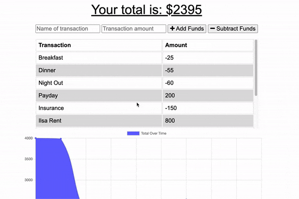

# Budget Tracker

[Link to repository](https://github.com/cah4758/budget-tracker)

[App link can be found here](https://budget-tracker-4758.herokuapp.com/)

## Description

Keep track of finances online AND offline. Practice app for indexedDB to give offline functionality.

## Table of Contents

- [Contribute](#how-to-contribute)
- [Questions](#questions)

## How to Contribute

Contact through [email](mailto:charlesh4758@gmail.com) to contribute to Budget Tracker.

## Questions

If you have any questions, contact me through [email](mailto:charlesh4758@gmail.com).

Check out other projects on [GitHub](http://www.github.com/cah4758).
